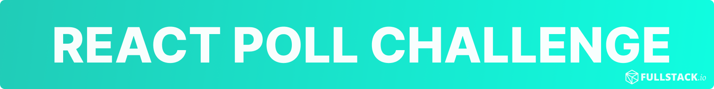
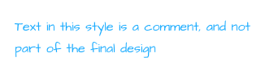
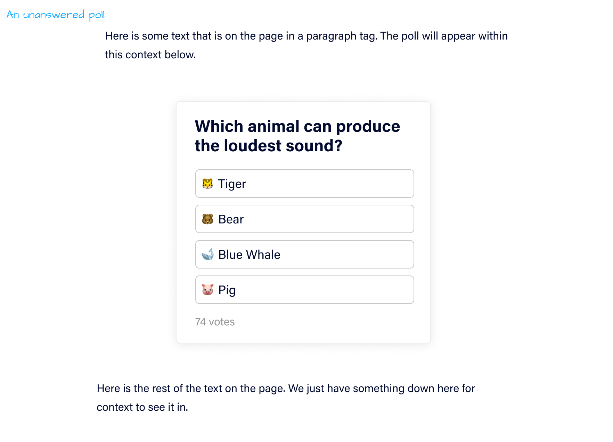
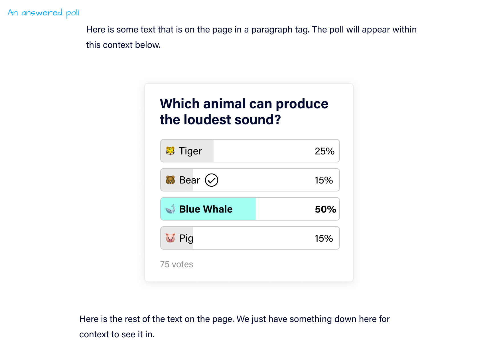
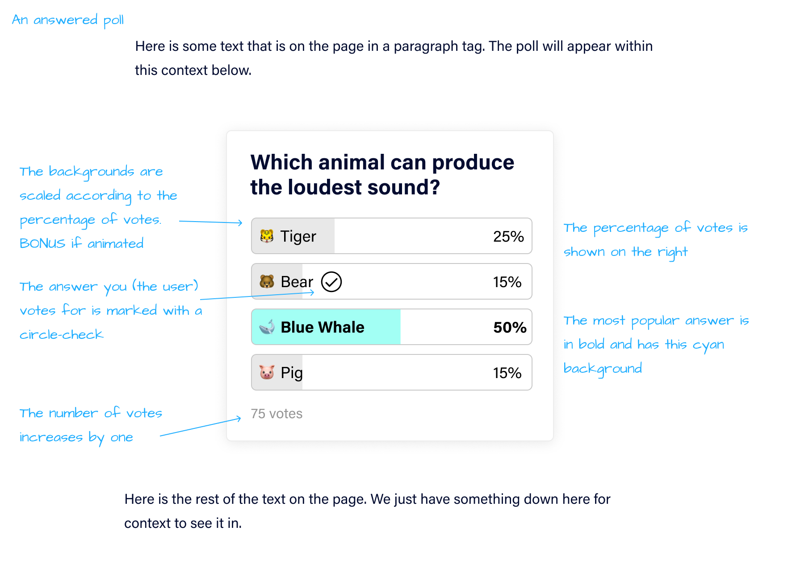

# Fullstack React Poll Challenge

At Fullstack, we use React for all of our front-end work and you'll be expected to take design specifications and mockups and turn them into working applications.

Below, we'll specify the challenge, describe the functionality, and give you tips and constraints along the way.

## The Challenge

Within our blog posts we can embed polls, which are a survey asking users which choice out of a list of items is their best guess or answer to a question.

> In each of the images below, the text the blue font style below are notes, not part of the design
>
> 

Here's what the poll should look like _before_ the user has answered:

And here is the result when the user votes for the answer _Bear_, (but the _Blue Whale_ answer has the most votes):

Here are additional notes of functionality:

**Your challenge**: create the above functionality using React (in TypeScript) using this repo as a starting point.

## Instructions

How to attempt this challenge:

1. Create a new repo in _your_ Github account and note the git url
2. Clone this repo
3. Solve the challenge
4. Set your new repo as the origin: `git remote set-url origin ${your repo url}`
5. Push your solution to your repo

You must follow these steps for your solution to be accepted -- **forks or other methods will not be considered**.

## Further Implementation Details

- **Show a random question from the question list on each page reload**
- **Do not install any other npm modules**
- Components should have their props typed ([example](./components/Poll.tsx))
- Maintain existing code styles (prettier, etc.)
- Any errors or missing features will disqualify the solution

## Tips

- The questions can be found in [`questions.json`](./questions.json) - we've loaded them for you in [`index.tsx`](./pages/index.tsx)
- We've started the `Poll` component for you in [`Poll.tsx`](./components/Poll.tsx)
- When you create new components, you should use `styled-components` in the same component style as `Poll.tsx`
- The closer your CSS-design looks to the mockup, the better

## BONUS

- **BONUS** (optional) points for any animations ([`pose`](https://popmotion.io/pose/) is included as a dependency if you choose to use it)
- **BONUS** (optional) if it looks good on both Desktop and Mobile
